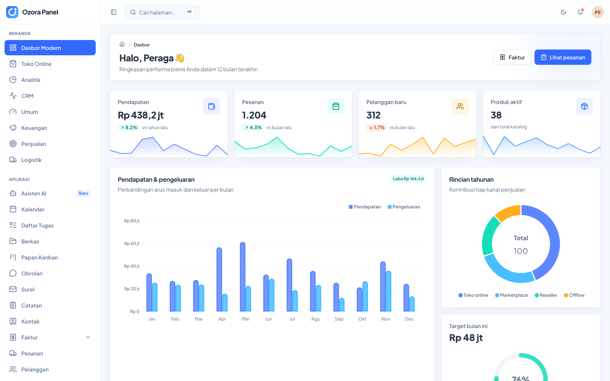
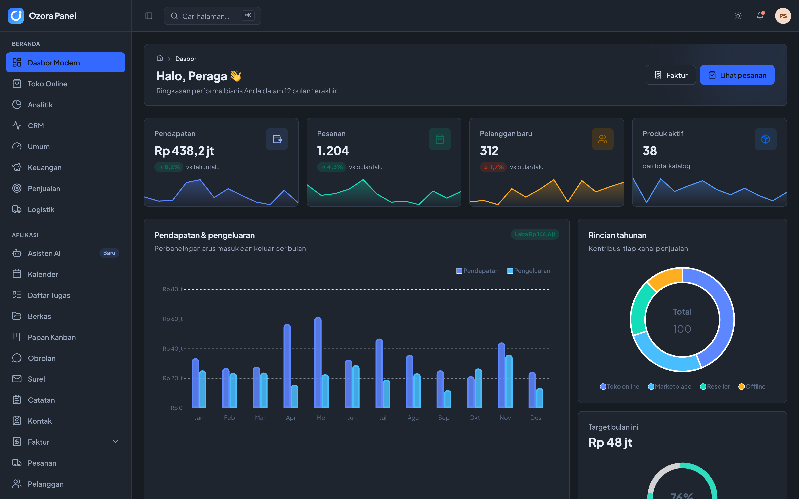
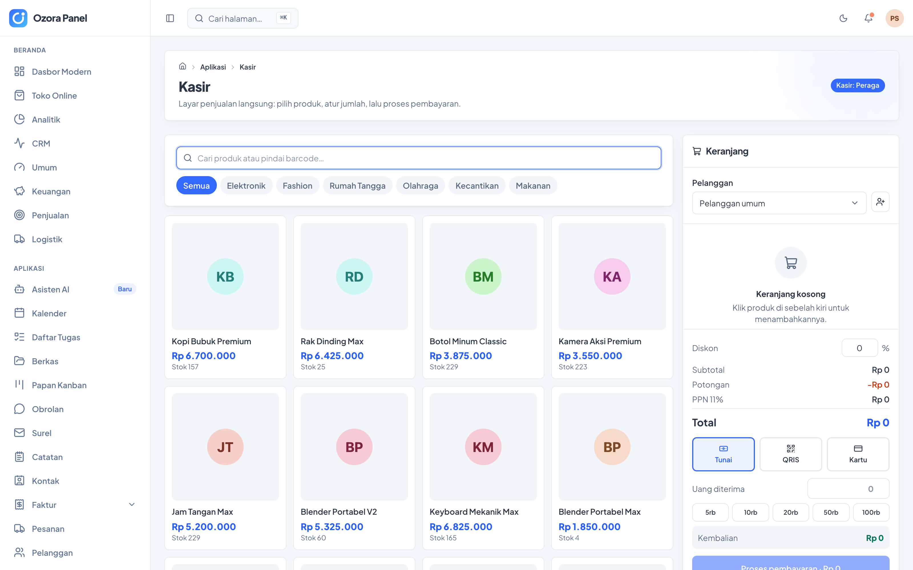
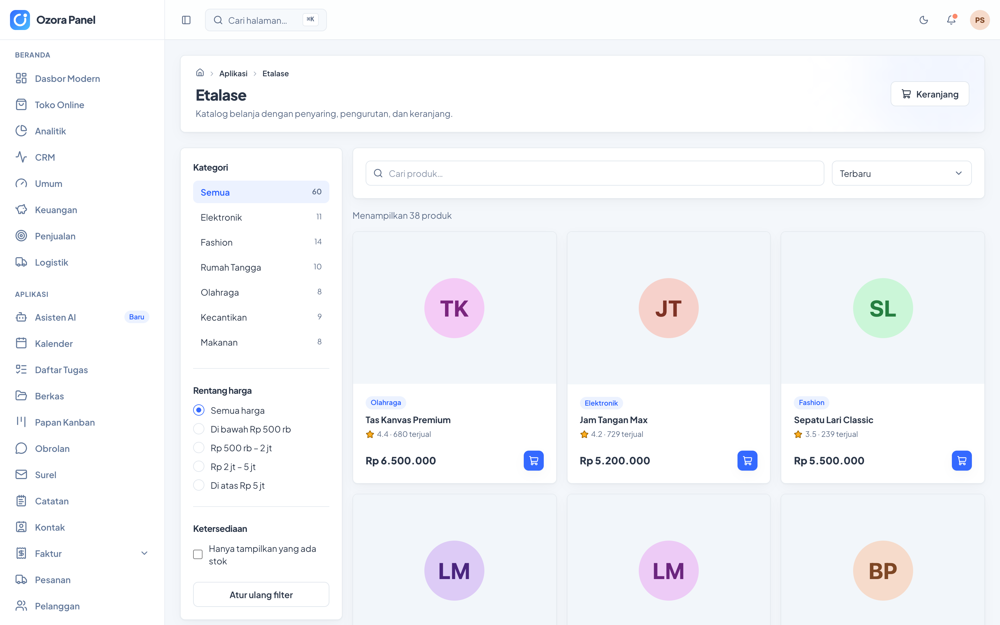
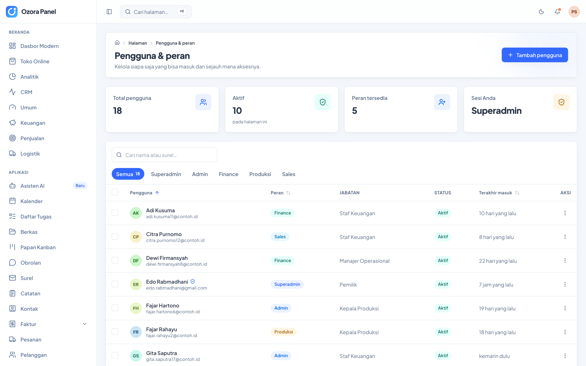
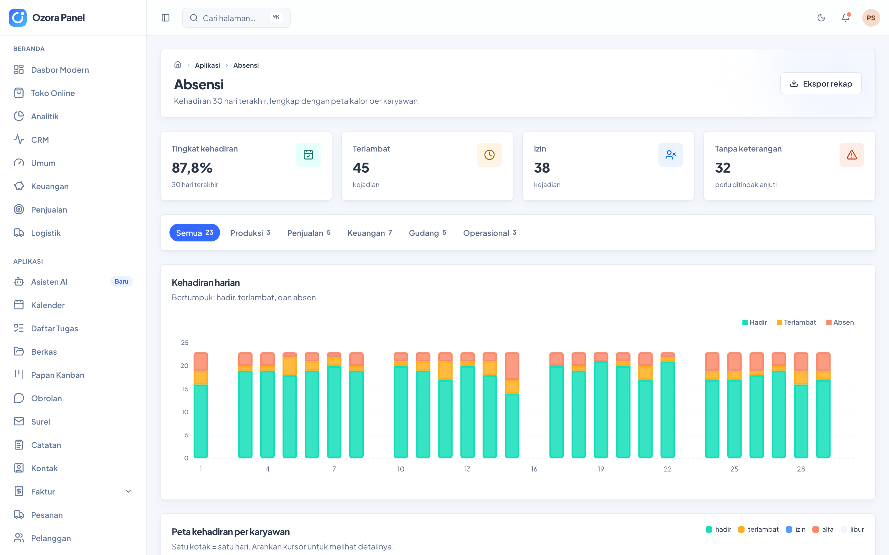
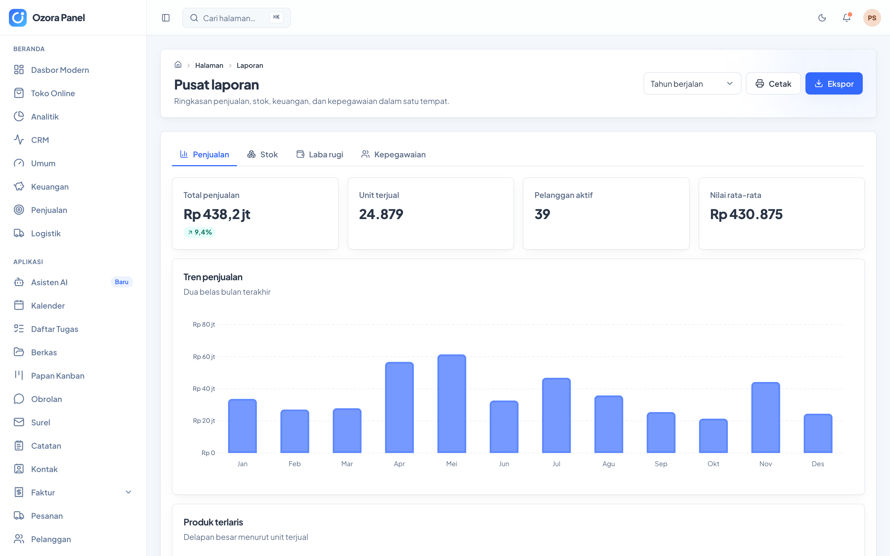
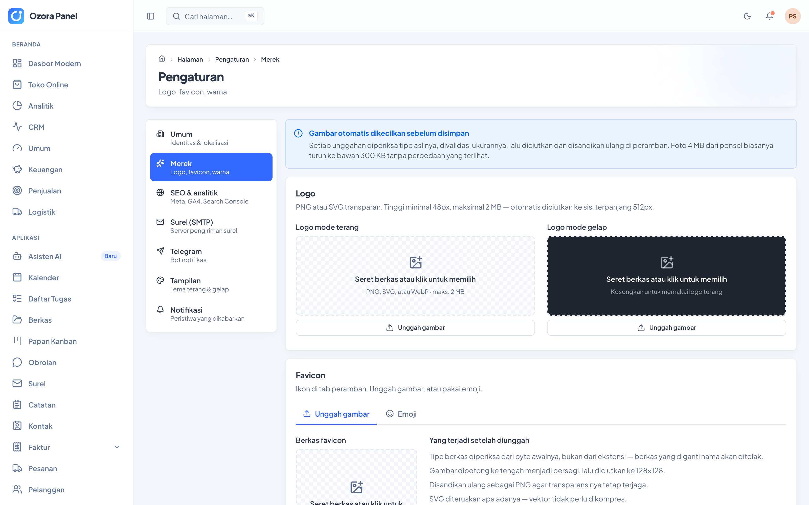

# Ozora Panel

Template panel admin — Vite 8 · React 19 · TypeScript 7 · Tailwind 4 · TanStack Router.
Antarmuka Bahasa Indonesia, autentikasi Google, dan kendali akses berbasis peran.



<p align="center">
  <b>101 halaman siap pakai · Bahasa Indonesia · lolos WCAG 2.1 AA</b><br>
  <sub>Build menghasilkan folder statis — bisa langsung naik ke cPanel, VPS, atau CDN mana pun.</sub>
</p>

---

## Tampilan

<table>
  <tr>
    <td width="50%"></td>
    <td width="50%"></td>
  </tr>
  <tr>
    <td align="center"><b>Mode terang</b></td>
    <td align="center"><b>Mode gelap</b> — dirancang terpisah, bukan sekadar balik warna</td>
  </tr>
</table>

<table>
  <tr>
    <td width="50%"></td>
    <td width="50%"></td>
  </tr>
  <tr>
    <td align="center"><b>Kasir (POS)</b> — keranjang, diskon, hitung kembalian, struk cetak</td>
    <td align="center"><b>Etalase</b> — filter kategori & harga, checkout tiga langkah</td>
  </tr>
  <tr>
    <td width="50%"></td>
    <td width="50%"></td>
  </tr>
  <tr>
    <td align="center"><b>Pengguna &amp; peran</b> — jalur emas CRUD, tinggal disalin</td>
    <td align="center"><b>Absensi</b> — peta kalor kehadiran 30 hari</td>
  </tr>
  <tr>
    <td width="50%"></td>
    <td width="50%"></td>
  </tr>
  <tr>
    <td align="center"><b>Pusat laporan</b> — penjualan, stok, laba rugi, kepegawaian</td>
    <td align="center"><b>Pengaturan merek</b> — ganti logo, favicon, warna dari panel</td>
  </tr>
</table>

---

## Mulai

```bash
pnpm install
cp .env.example .env.local
pnpm dev            # http://localhost:5180
```

Bawaannya memakai driver `mock` — tidak perlu backend. Di halaman masuk ada
tombol untuk mencoba setiap peran dan melihat perbedaan hak aksesnya.

## Perintah

| Perintah | Fungsi |
|---|---|
| `pnpm dev` | Server pengembangan |
| `pnpm build` | Build produksi ke `dist/` |
| `pnpm preview` | Uji hasil build secara lokal |
| `pnpm typecheck` | Pemeriksaan tipe |
| `pnpm lint` | oxlint |
| `pnpm test` | Vitest |
| `pnpm analyze` | Visualisasi ukuran bundle |
| `pnpm demo:strip` | Buang seluruh halaman peraga |

## Isi

**Kerangka** — sidebar yang bisa diringkas, topbar lengket, mode terang/gelap/ikut
sistem, palet perintah (⌘K), remah roti otomatis, dan tata letak responsif.

**Autentikasi & peran** — masuk lewat Google, lima peran (Superadmin, Admin,
Finance, Produksi, Sales), matriks izin dengan wildcard dan penolakan eksplisit,
serta dua surel superadmin bawaan yang tidak bisa diturunkan.

**Data** — satu lapisan adapter dengan tiga driver: `mock`, `supabase`, dan `rest`.
Driver yang tidak dipakai tidak ikut ke bundle.

**Halaman** — 101 rute:

- **Sembilan dasbor** — Modern, Toko online, Analitik, CRM, Umum, Keuangan,
  Penjualan, Logistik, plus halaman Peta sebaran
- **Aplikasi** — Asisten AI, Kalender, Daftar tugas, Papan kanban, Berkas,
  Obrolan, Surel, Catatan, Kontak, Proyek, Ulasan, Faktur (daftar + buat +
  detail), Etalase (katalog + detail + checkout), Profil pengguna (lini masa +
  pengikut + teman + galeri), Pesanan, Pelanggan, Produk (daftar + tambah),
  Transaksi (daftar + detail), Blog (daftar + detail + **penyunting teks kaya**),
  Tiket (daftar + balas)
- **Ritel & stok** — Kasir (POS lengkap dengan struk), Stok (mutasi, gudang,
  penyesuaian), Pembelian, Supplier, Promo & kupon
- **Kepegawaian** — Karyawan, Absensi (peta kalor 30 hari), Cuti & izin dengan
  alur persetujuan, Penggajian dengan slip gaji
- **Elemen UI** — galeri komponen, komponen lanjutan, ikon, animasi, warna & tipografi
- **Formulir** — elemen, tata letak, bertahap, validasi, tambahan
- **Widget, tabel, dan enam jenis bagan**
- **Pengaturan** — Umum, Merek (ganti logo terang/gelap, favicon, warna),
  SEO & analitik (GA4, GTM, Search Console, Bing, Meta Pixel, robots.txt,
  sitemap), Surel/SMTP dengan uji kirim, Telegram dengan panduan setup,
  Tampilan, Notifikasi
- **Halaman sistem** — Pengguna & peran, Hak akses, Profil, Pusat laporan,
  Jejak audit, Integrasi, Kunci API, Tagihan, Harga, Tanya jawab, Halaman
  depan, Halaman kosong
- **Autentikasi & status** — Masuk, Daftar, Lupa sandi, Dua faktor, Perawatan,
  Segera hadir, Berhasil, Galat 404 / 500 / 503

## Memulai project baru dari template ini

```bash
cp -r "ozora dashboard panel" project-baru && cd project-baru
pnpm install
pnpm demo:strip      # buang ~40 halaman peraga
pnpm build && pnpm typecheck
```

Yang tersisa: kerangka aplikasi, autentikasi + RBAC, halaman Pengguna sebagai
contoh CRUD lengkap, Profil, Pengaturan, Jejak audit, Kunci API, dan seluruh
pustaka komponen.

## Dokumentasi

| Berkas | Isi |
|---|---|
| [`docs/PANDUAN.md`](docs/PANDUAN.md) | **Mulai dari sini** — panduan lengkap dari instalasi sampai deploy |
| [`docs/RESEP.md`](docs/RESEP.md) | Langkah baku: menambah halaman, modul CRUD, bagan, peran; menyambung Supabase/REST; menerbitkan ke server |
| [`docs/ARSITEKTUR.md`](docs/ARSITEKTUR.md) | Keputusan arsitektur beserta alasannya |
| [`.claude/CLAUDE.md`](.claude/CLAUDE.md) | Panduan untuk Claude Code |

## Menerbitkan

`pnpm build` menghasilkan folder statis. Tidak ada proses Node yang perlu berjalan —
salin `dist/` ke cPanel, VPS, atau CDN mana pun. Konfigurasi `.htaccess` dan nginx
ada di [`docs/RESEP.md`](docs/RESEP.md#7-menerbitkan-ke-server).
